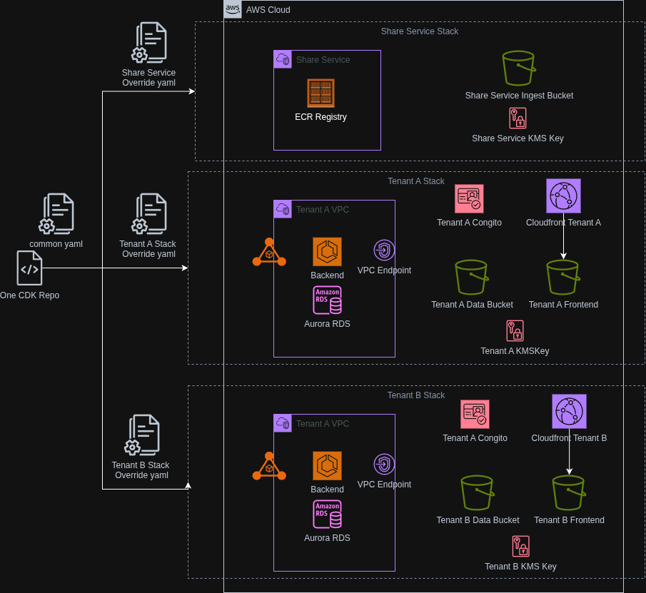
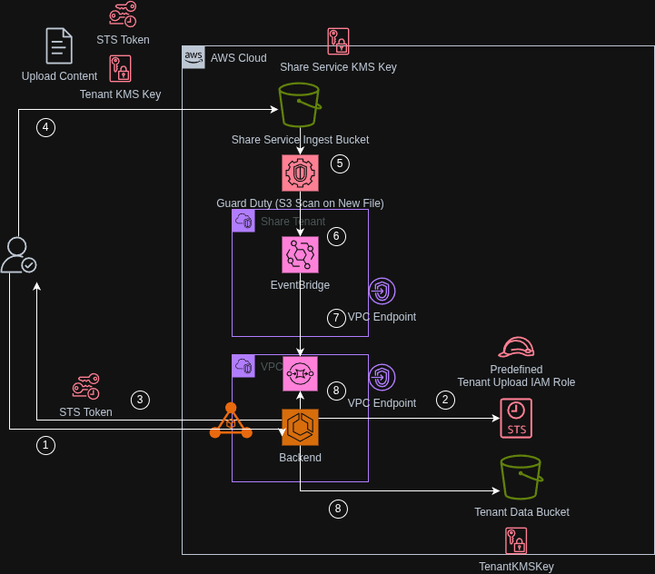

# A Sample to demo ability to manage share service and multi tenant stacks through one set of CDK

# STILL NOT STABLE, DO NOT USE IN PRODUCTION AS IS

## Overall Architecture

Overall Setup Flow


Upload flow


Utilize layers of config
```text
config
  |_dev -> environment
    |_common.yaml -> common values
    |_share-service.yaml -> share service stack config, inherit any common if not override
    |_test-tenant-1123.yaml -> example tenant stack config, inherit any common if not override
```

## Requirements
1. Install [AWS CDK](https://docs.aws.amazon.com/cdk/v2/guide/getting-started.html)
2. Install AWS CLIBelow utilize a self-signed cert

## Setup Steps

1. Create self-signed cert, or import a proper cert
```bash
# Generate a private key
openssl genrsa -out private.key 2048

# Create the self-signed certificate (valid for 365 days)
# Note: You can leave the prompts blank, but set 'Common Name' to your ALB DNS if known, or just 'test.com'
openssl req -new -x509 -key private.key -out certificate.crt -days 365

# install cert into aws account
aws acm import-certificate --certificate fileb://certificate.crt --private-key fileb://private.key

```
2. Copy the output above into `config/dev/test-tenant-1123.yaml` into `publicCertArn` field like below
```yaml
publicCertArn: "arn:aws:acm:us-west-2:122212112:certificate/fda5d3b0-fcde-43b2-2224-1be55d5ceae2"
```

3. Setup share service and deploy docker images into ecr
```bash
# first deploy share service (please ensure to update all config in common folder)
cdk deploy -c tenantId=share-service

# login to ECR registry
#  uri from above share service output, such as 111116177016.dkr.ecr.us-west-2.amazonaws.com/share-service-api-service
aws ecr get-login-password --region us-west-2 | docker login --username AWS --password-stdin 111116177016.dkr.ecr.us-west-2.amazonaws.com/share-service-dev-api-service

# build and push the docker images
cd services/api/
docker build -t api-al2023 .

# optional test docker image
docker run -p 8080:8080 api-al2023 
# should able to hit http://localhost:8080/api/v1/health and get result
# exit the above docker run by doing ctrl + C

docker tag api-al2023:latest 111116177016.dkr.ecr.us-west-2.amazonaws.com/share-service-dev-api-service:1.0
docker push 111116177016.dkr.ecr.us-west-2.amazonaws.com/share-service-dev-api-service:1.0
# back to root
cd ../../
```

4. Deploy one of tenant 
```bash
cdk deploy -c tenantId=test-tenant-1123.yaml
```

